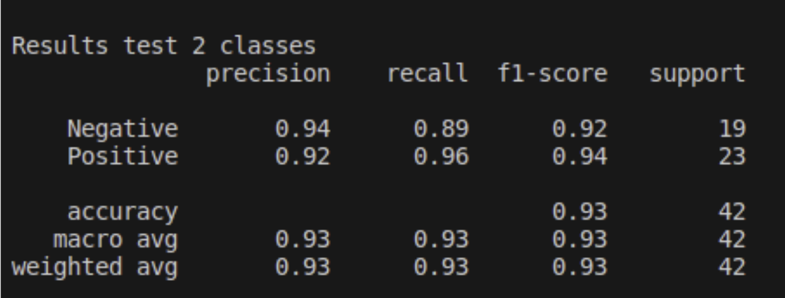

# Medical_Image
## Structure
- **performance**: Images with the results of the different approaches
- **project**: The code of the project
  - **Autoencoder_aproach**: Files used to train and test the autoencoder
  - **CNN_approach_files**: Files used to fine-tune and test the CNNs
  - **Classifier_patches_pacients**: Folder with the scripts to classify patches in the autoencoder approach and patients in both approaches
  - **models**: Script with different autoencoders
  - **setups**: Setups used to train the autoencoders
  - **setups_clf**: Setups used to fine-tune the classifiers
  - **autoncoder_vs_CNN.ipynb**: Comparison of parameters and inference time of both models.
  - **dataset.py**: different pytorch datasets used
  - **metrics.py**: Metrics used as reconstruction error in the autoencoder
  - **partition_dataset.ipynb**: Notebook to split the patients in train and test
  - **preprocessing.ipynb**: Notebook to do the image preprocessing 
  - **utils.py**: Different helper functions used
  - **visualize_annotated_classes.py**: Visualization of the autoencoder generated images per class
### Results
- Results on patches
- Results on patients

<b>Performance Autoencoder approach:</b>

### Patch classification 

### Patient classification

<b>Performance CNN approach:</b>

### Patch classification 

### Patient classification

&nbsp;
