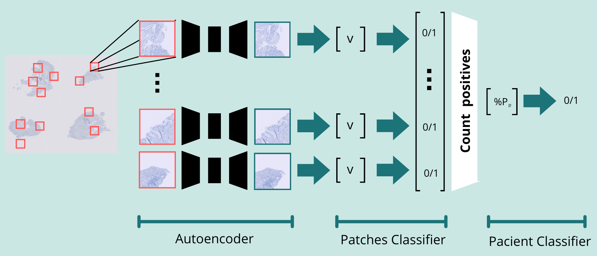
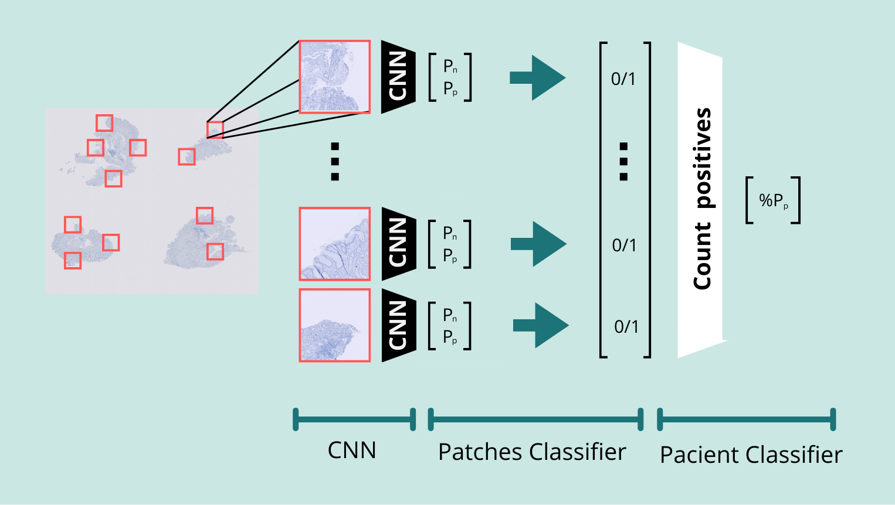
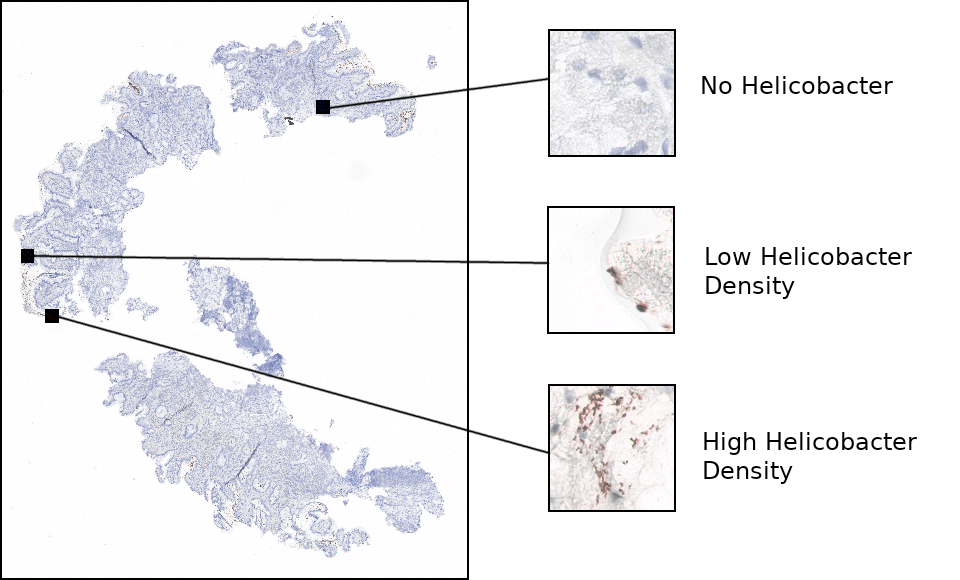
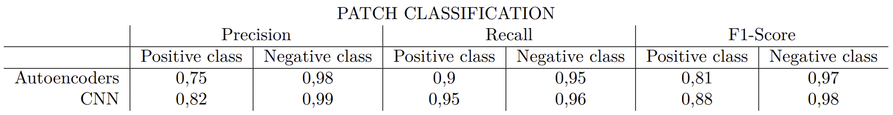
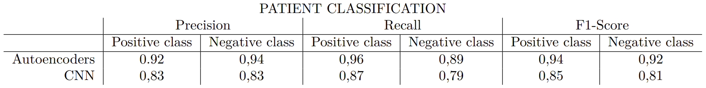

# Visual Anomaly Detection - Medical Imaging

In this repository, you can find an implementation of a visual anomaly detection pipeline using autoencoders and CNNs, specifically tailored for detecting the presence of Helicobacter pylori in stained medical images. 

## Motivation 
Traditional methods for detecting H. pylori involve labor-intensive manual inspection of digitized histological images by expert pathologists. This process is time-consuming and subjective, leading to potential errors. Our motivation is to develop an automated system that can accurately and efficiently detect H. pylori in histological images, thereby aiding pathologists in their diagnostic workflow.

## Methodology
We propose two methodologies: 
- Use autoencoders to learn latent patterns of healthy tissue and identify anomalies. Since autoencoders can learn patterns in a self-supervised manner we eliminate the need for extensive image annotations.

  

                     

         
  
- Train a CNN with the few annotated patches given.
  

## Data 
The dataset has the structure:   
Cropped_Patches:
- Patient1
  - Crop 1
  - Crop 2
  - ...
- Patient2
  - Crop 1
  - Crop 2
  - ...

Annotated_Patches: 
- Patient2
- - Crop 1
  - Crop 2
  - ...
- Patient10
- - Crop 1
  - Crop 2
  - ...
 
We have a csv indicating the diagnosis of each patient from the Cropped_Patches folder and a csv indicating the diagnosis of some patches, the ones stored in Annotated_Patches.

The data looks like the following:   
 

## Performance

